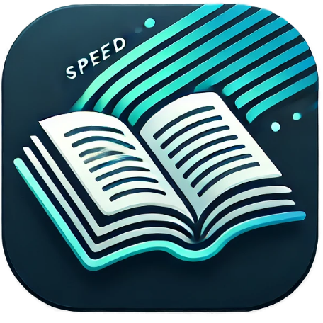
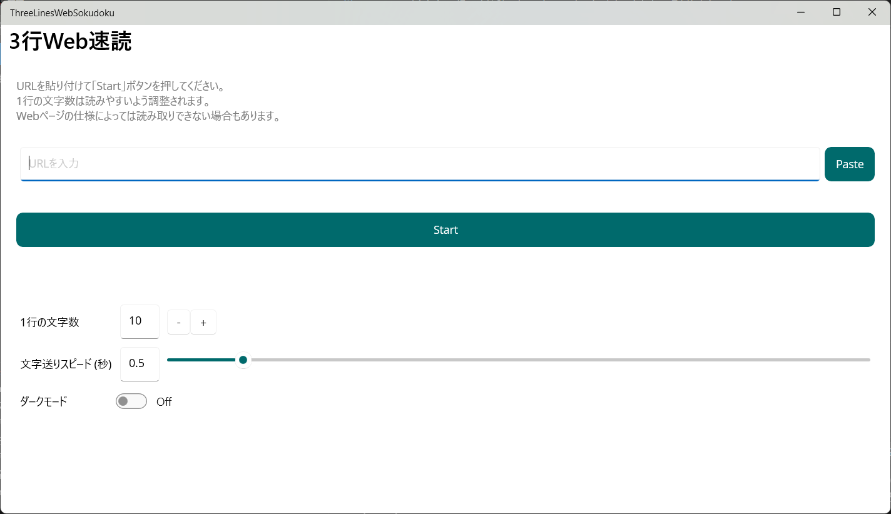
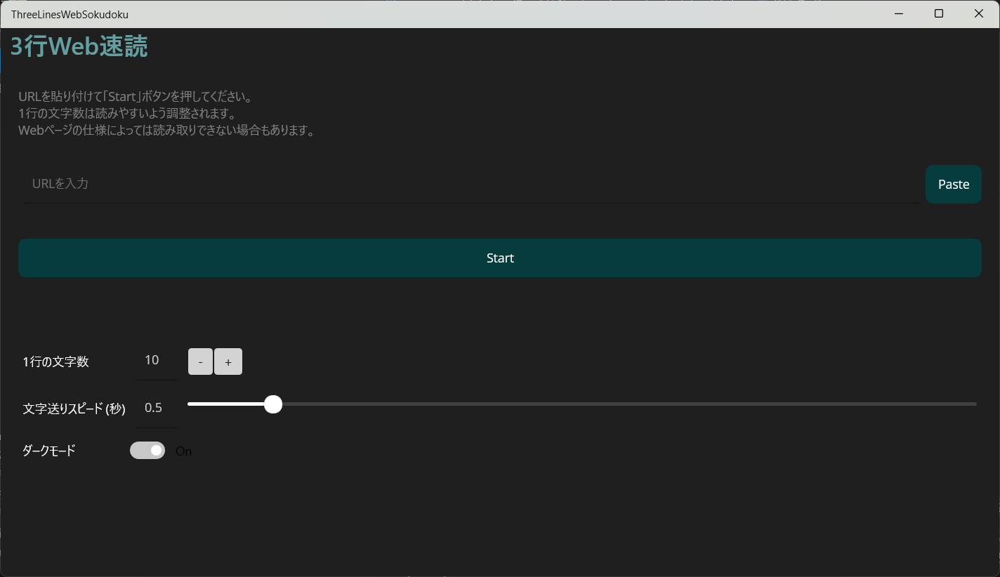
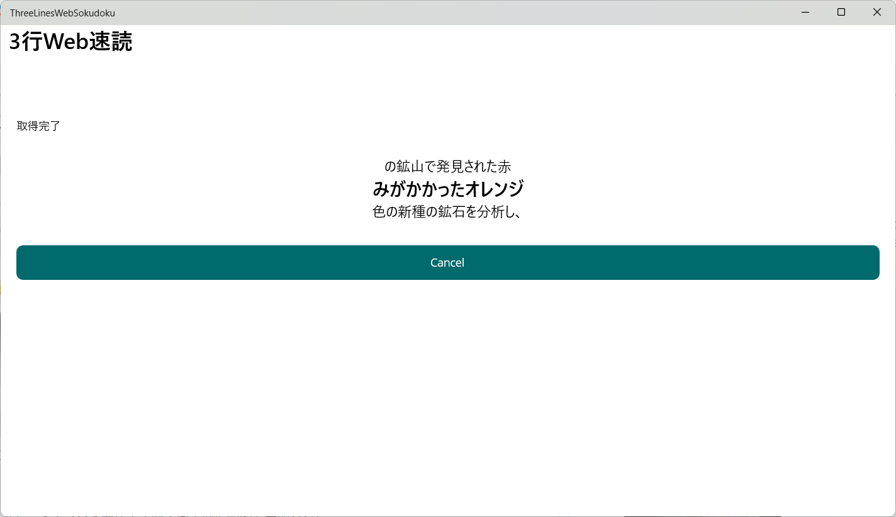
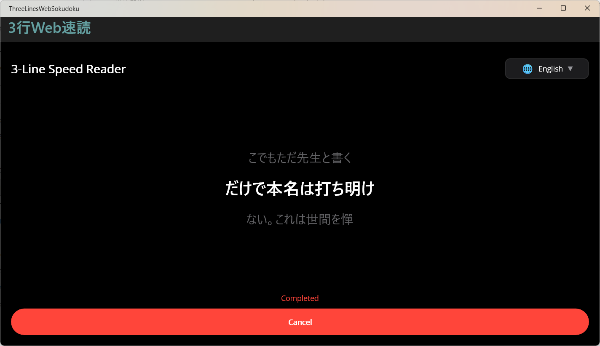

# 3行Web速読 (ThreeLinesWebSokudoku)

**ウェブページを効率的に速読するためのアプリ**

 

**概要**

3行Web速読は、ウェブページやテキストを3行ずつ表示することで、効率的な速読トレーニングをサポートするアプリです。画面上に3行ずつ表示することで、集中力を維持しながら情報を素早く読み取ることができます。

 

## ✨ 最新の更新情報

### 🌐 多言語対応
* **日本語/英語UI切り替え機能を追加**: スイッチで簡単に言語を切り替え可能。海外ユーザーにも対応しました。
* **国際化対応**: UI全体が日本語・英語の両方に対応し、より幅広いユーザーに利用いただけます。

### 🎨 デザイン改善
* **モダンなUIデザイン**: .NET MAUIの最新UIコンポーネントを活用した洗練されたデザインに刷新しました。
* **カラーパレットの最適化**: ライトモード・ダークモードそれぞれで視認性の高い配色を実現しました。
* **タイポグラフィの改善**: 読みやすさを重視したフォント設定で、長時間の使用でも疲れにくい設計です。
* **レスポンシブデザイン**: Windows・Androidそれぞれのプラットフォームに最適化されたレイアウトを実装しました。
* **アクセシビリティの向上**: WCAG AA基準を満たすコントラスト比で、より多くのユーザーに快適にご利用いただけます。

### その他の改善
* スマートモードを追加し、より自然な文章の区切りで速読できるようになりました。
* 文字サイズの変更機能を追加し、お好みのサイズで快適に読めるようになりました。
* URL入力だけでなく、テキスト入力にも対応し、様々なコンテンツを速読できるようになりました。
* 内部処理を改善し、アプリの安定性を向上させました。

 

## ✨ 特長

### 📖 3行表示による効率的なトレーニング
* **3行表示:** 読みやすさを追求した、独自レイアウト。視線移動を最小限に抑え、集中力を高めます。
* **中央の2行目を強調表示:** 自然な読書リズムを実現し、視覚的な負担を軽減します。
* **長時間使用でも疲れにくい設計:** 視認性の高い配色とフォントで、長時間のトレーニングにも対応します。

### ⚡ カスタマイズ可能な表示設定
* **⏱️ 速読トレーニング:** スピードや1行あたりの文字数を調整可能。自分のペースでトレーニングできます。
* **文字サイズ変更:** お好みの文字サイズで、より見やすく調整できます（8pt～32pt）。
* **表示速度の調整:** スライダーで行切替間隔を自由に設定（0.1秒～10.0秒）。

### 🌐 多言語対応
* **日本語/英語UI切り替え:** スイッチで簡単に言語を切り替え可能。海外ユーザーにも対応しました。
* **国際化対応:** UI全体が日本語・英語の両方に対応し、より幅広いユーザーに利用いただけます。

### 🎨 モダンなデザイン
* **ダークモード対応:** 目に優しいダークモードに切り替え可能。暗い場所でも快適に利用できます。
* **洗練されたUI:** .NET MAUIの最新UIコンポーネントを活用したモダンなデザイン。
* **レスポンシブデザイン:** Windows・Androidそれぞれのプラットフォームに最適化されたレイアウト。
* **アクセシビリティ:** WCAG AA基準を満たすコントラスト比で、より多くのユーザーに快適にご利用いただけます。

### 🤖 スマートモード（形態素解析対応）
* **⚙️ スマートモード:** 自然な文章の区切りで、より快適な速読体験を提供します。
* **MeCabによる日本語形態素解析:** 単語の途中で改行されない自然な文節分割を実現。
* **自動フォールバック:** MeCabが利用できない環境でも自動的にフォールバックし、確実に動作します。

### 📝 柔軟な入力方法
* **テキスト入力対応:** URLだけでなく、文章を直接入力して速読できます。
* **URL入力:** ウェブページのURLを入力するだけで、自動的に本文を抽出します。
* **ペースト機能:** クリップボードからワンタップで貼り付け可能です。
* **本文の自動抽出:** AngleSharpによる高度な本文抽出アルゴリズムで、広告やナビゲーションを除外します。

 

## 📥 ダウンロード

* **For Windows:** [Microsoft Store で今すぐダウンロード](https://apps.microsoft.com/detail/9MVZP1C80KV6?hl=ja-jp&gl=JP&ocid=pdpshare)
* **For Mac:** ダウンロードリンク（準備中）
* **For iOS:** ダウンロードリンク（準備中）
* **For Android:** ダウンロードリンク（準備中）

**無料でお試しいただけます**

 

## 📖 使い方

1. **アプリをインストールします。**
2. **コンテンツの入力**: 速読したいWebページのURLかテキストを入力します。
3. **設定の調整**: 速度、文字数、フォントサイズを自分のレベルに合わせて設定します。
4. **言語の選択**: 必要に応じて日本語/英語UIを切り替えます。
5. **3行表示モードで速読を開始します。**
6. **集中して読む**: 3行ずつ表示されるテキストに集中して読書トレーニングを行います。

### 便利な機能

* **ダークモード**: ダークモードを利用すると目に優しい表示になります。
* **スマートモード**: スマートモードを利用するとより自然な区切り方になります。
* **文字サイズ変更**: 文字サイズを変更して、読みやすい大きさに調整できます。
* **多言語対応**: 日本語/英語UIを切り替えて、お好みの言語で利用できます。
* **テキスト直接入力**: 一部読み取りできないWebサイトなどは文章をコピペしてご利用ください。

### 技術情報

* ※このアプリではMeCab.DotNetの技術を利用しています。
* （This application uses MeCab.DotNet v1.2.0 Copyright (C) 2006-2013 Taku Kudo and Nippon Telegraph and Telephone Corporation Copyright (C) 2019-2023 Kouji Matsui (@kekyo2) Licensed under LGPL 2.1 Source code available at: https://github.com/kekyo/MeCab.DotNet）

 

## 📸 スクリーンショット

### アプリ画面（ライトモード）

### 実行画面（ライトモード）

### アプリ画面（ダークモード）

### 実行画面（ダークモード）

 

## 🔒 プライバシーとセキュリティ

* アプリはローカルで動作し、ユーザーデータをサーバーに送信することはありません
* URL指定時は、該当ページの本文取得のみを行います
* 個人情報の収集・保存は一切行いません

[プライバシーポリシーはこちら](privacy.md)

 

## 📧 お問い合わせ

アプリに関するお問い合わせやご要望は、以下のフォームからお気軽にご連絡ください。

[お問い合わせはFormrunから](https://form.run/@yahoo-eF6XHIch4UKZT592Vk5I)

## 🔧 技術仕様

* **プラットフォーム**: Windows
* **開発フレームワーク**: .NET MAUI (.NET 10)
* **主要ライブラリ**: AngleSharp, MeCab.DotNet
* **ライセンス**: MeCabはLGPL 2.1ライセンス
* **対応言語**: 日本語、English、中文、한국어、हिन्दी、Español、Français、العربية

 